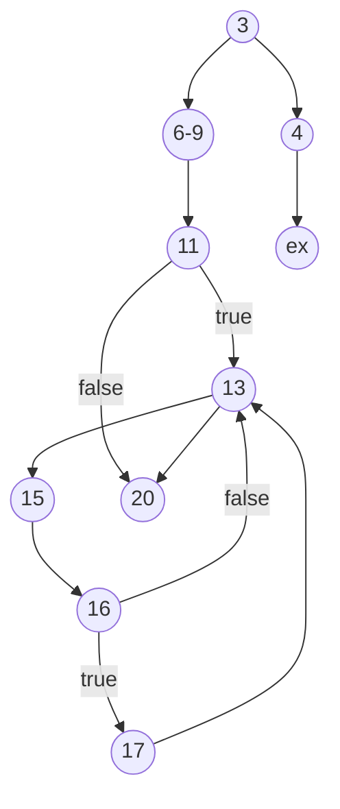

# Presentation 3

```csharp
1: public async Task<List<DateTime>> GetFullyOccupiedDates(DateTime startDate, DateTime endDate)
2: {
3:     if (startDate > endDate)
4:         throw new ArgumentException("The start date cannot be later than the end date.");
5:
6:     List<DateTime> fullyOccupiedDates = new List<DateTime>();
7:     var rooms = await roomRepository.GetAllAsync();
8:     int noOfRooms = rooms.Count();
9:     var bookings = await bookingRepository.GetAllAsync();
10:
11:     if (bookings.Any())
12:     {
13:         for (DateTime d = startDate; d <= endDate; d = d.AddDays(1))
14:         {
15:             var noOfBookings = bookings.Where(b => b.IsActive && d >= b.StartDate && d <= b.EndDate).Count();
16:             if (noOfBookings >= noOfRooms)
17:                 fullyOccupiedDates.Add(d);
18:         }
19:     }
20:     return fullyOccupiedDates;
21: }
```


