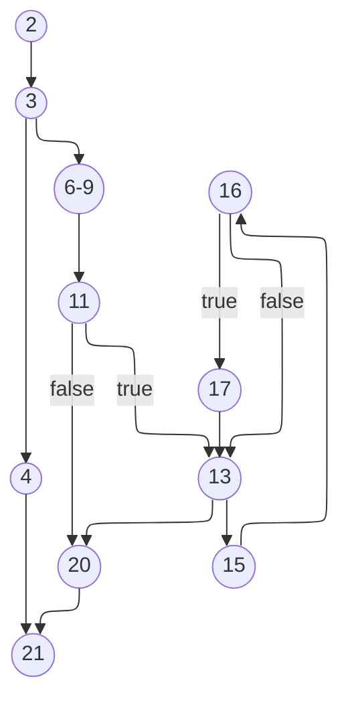
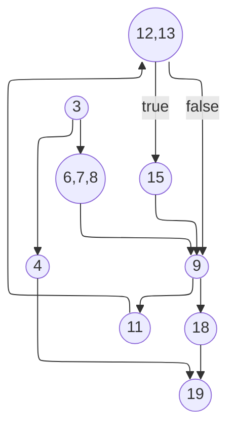

# Presentation 3

## Get fully occupied dates

```csharp
1: public async Task<List<DateTime>> GetFullyOccupiedDates(DateTime startDate, DateTime endDate)
2: {
3:     if (startDate > endDate)
4:         throw new ArgumentException("The start date cannot be later than the end date.");
5:
6:     List<DateTime> fullyOccupiedDates = new List<DateTime>();
7:     var rooms = await roomRepository.GetAllAsync();
8:     int noOfRooms = rooms.Count();
9:     var bookings = await bookingRepository.GetAllAsync();
10:
11:     if (bookings.Any())
12:     {
13:         for (DateTime d = startDate; d <= endDate; d = d.AddDays(1))
14:         {
15:             var noOfBookings = bookings.Where(b => b.IsActive && d >= b.StartDate && d <= b.EndDate).Count();
16:             if (noOfBookings >= noOfRooms)
17:                 fullyOccupiedDates.Add(d);
18:         }
19:     }
20:     return fullyOccupiedDates;
21: }
```



## Cyclomatic Complexity: 5

1. M = E − N + 2

- Nodes (N) = 11
- Edges (E) = 14
- M = 14 − 11 + 2·1 = 5

---

## Multiple Condition Coverage (MCC)

(2^3 = 8) of the three chosen conditions and the simple expected outcome for each.

Conditions:

- A: startDate > endDate (precondition — if true the method throws)
- B: bookings.Any() (are there any bookings?)
- C: noOfBookings >= noOfRooms (on a particular date d — decides whether d is added)

Gray-code 8-row table (A, B, C):

| Row | A | B | C | Outcome |
|-----:|:-:|:-:|:-:|:--------|
| 1 | 0 | 0 | 0 | No bookings → returns empty list |
| 2 | 0 | 0 | 1 | Infeasible (no bookings) → treat as empty list |
| 3 | 0 | 1 | 1 | At least one fully-occupied date → that date(s) returned |
| 4 | 0 | 1 | 0 | Bookings exist but no fully-occupied date → empty list |
| 5 | 1 | 1 | 0 | Precondition fail → throws ArgumentException |
| 6 | 1 | 1 | 1 | Precondition fail → throws ArgumentException |
| 7 | 1 | 0 | 1 | Precondition fail → throws ArgumentException |
| 8 | 1 | 0 | 0 | Precondition fail → throws ArgumentException |

- Test 1 — Precondition: A = 1 → assert ArgumentException.
- Test 2 — No bookings: A = 0, B = 0 → expect empty list.
- Test 3 — Bookings but no full occupancy: A = 0, B = 1, C = 0 → expect empty list.
- Test 4 — Bookings with full occupancy: A = 0, B = 1, C = 1 → expect returned date(s).

if there are zero rooms (noOfRooms == 0) then C is true for every date and the method will return all dates in the range when B = 1 and A = 0; treat this as a separate test input if needed.

## Find available room

```csharp
1: public async Task<int> FindAvailableRoom(DateTime startDate, DateTime endDate)
2: {
3:     if (startDate <= DateTime.Today || startDate > endDate)
4:         throw new ArgumentException("The start date cannot be in the past or later than the end date.");
5:
6:     var bookings = await bookingRepository.GetAllAsync();
7:     var activeBookings = bookings.Where(b => b.IsActive);
8:     var rooms = await roomRepository.GetAllAsync();
9:     foreach (var room in rooms)
10:     {
11:         var activeBookingsForCurrentRoom = activeBookings.Where(b => b.RoomId == room.Id);
12:         if (activeBookingsForCurrentRoom.All(b => startDate < b.StartDate &&
13:             endDate < b.StartDate || startDate > b.EndDate && endDate > b.EndDate))
14:         {
15:             return room.Id;
16:         }
17:     }
18:     return -1;
19: }
```



## Cyclomatic Complexity: 4

1. M = E − N + 2

- Nodes (N) = 9
- Edges (E) = 11
- M = 11 − 9 + 2·1 = 4
